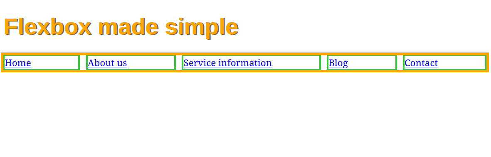

So what I learned so far:

Если поставить .nav-list li {
    width: max-content;
}
То это не позволяет контенту wrap'иться, то есть Не будет
```
Мурзин
Святослав
```
А будет просто 
```
Мурзин Святослав
```
Но! В случае, если мы ставим
.nav-list li {
    width: min-content;
}
То это будет wrappa'аться именно так:
```
Мурзин
Святослав
```
Причем тут flex-box?
На самом деле, когда не хватает места (при уменьшении страницы по горизонтали), текст во флексе начинает съезжать на строку вниз.
### Flex-shrink
Почему? Из-за таких свойств, которые называются flex-shrink и flex-grow, сейчас все расскажем.
Если сделать flex-shrink: 0;

Можно догадаться, что будет, если сделать 1. 
### Flex-grow
Дефолтное значение для flex-grow: 0; Что же оно делает?

### Flex-wrap
flex-wrap: wrap; решает проблему нехватки места, переносит на новую строку. Это почти как flex-shrink, только flex-wrap и вообще не про это.
