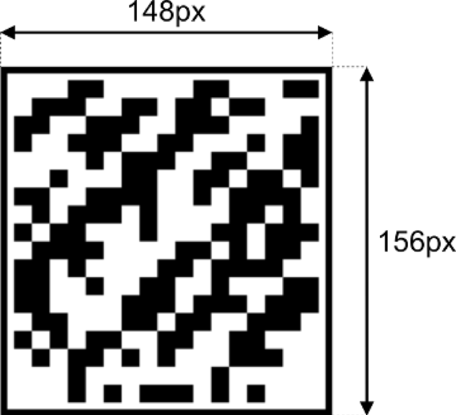

Условие:

За окном 2319 год. Корпорации клонируют успешных сотрудников, чтобы они выполняли сложные задачи.

На производстве клонов решили маркировать новые «изделия» с помощью татуировки с баркодом на плече — чтобы отличать клонов между собой.

Помогите сотрудникам фабрики написать функцию, которая будет отрисовывать баркод с информацией о клоне.

Формат информации о клоне

Информация о клоне хранится в следующем виде:

```
type CloneInfo = {
    /**
     * Пол клона — строка ’male’ или ’female’
     */
    sex: string;
    /**
     * Идентификатор клона — строка из маленьких и больших
     * латинских букв и цифр, строго 10 символов
     */
    id: string;
    /**
     * Имя клона — строка из маленьких и больших
     * латинских букв и пробелов (от 0 до 26 символов)
     */
    name: string;
}
```

Алгоритм отрисовки баркода

Баркоды, которые используют на фабрике клонов, выглядят так:



Баркод имеет фиксированный размер — 148 на 156 пикселей. По периметру баркода находятся чёрная и белая рамки по 3 пикселя шириной каждая. Внутри рамок находится контент баркода, состоящий из 18 строк по 17 чёрных или белых квадратов в строке. Размер каждого квадрата — 8 на 8 пикселей.

Белые квадраты в контенте кодируют 0, чёрные — 1.

Алгоритм формирования контента баркода

На пересечении первой строки и первого столбца контента отрисовывается квадрат, кодирующий пол клона. Значение female кодируется нулём (белый цвет), male — единицей (чёрный цвет).

Далее из полей id и name формируется строка вида <id><name>. Поле name дополняется пробелами в конце до 26 символов.

Полученная строка конвертируется в байтовый массив — каждому символу строки ставится соответствующий ASCII-код (число от 0 до 255).

Затем каждый элемент полученного массива переводится в двоичную запись (восемь символов 0 или 1) и кодируется последовательностью из восьми квадратов (0 — белый квардрат, 1 — чёрный квадрат). Квадраты отрисовываются в контенте баркода последовательно и построчно.

В последней строке контента находится контрольная информация.

Алгоритм подсчёта контрольной информации

Каждый квадрат в строке контрольной информации определяет чётность суммы значений контента в соответствующем столбце. Если сумма нулей и единиц в столбце чётная, то в контрольной информации рисуется белый квадрат, в противном случае — чёрный.

О чем желательно знать, чтобы понимать это задание:
1) Что такое type typeName = {...}
2) Функция padStart();